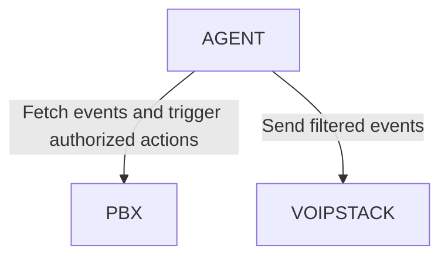

## Effortless Operator Panel: Enhance Your Business with Our Operator Panel.

We’re introducing an operator panel designed to optimize and streamline your VoIP services efficiently, intuitively, and securely.

### OUR SOLUTION

* User-Friendly Interface: Easy to navigate, even for less experienced users.
* Real-Time Traffic Management: Monitor and control active calls instantly.
* Highly Customizable: Tailor routing rules to meet your specific operational needs.
* Secure Integration: Seamlessly compatible with leading softswitches and gateways.

### BILLING

* Pay-As-You-Go Model: Only pay for what you use. Our pricing adapts to your operational needs, ensuring cost efficiency without sacrificing quality.
* No Fixed Contracts: Avoid unnecessary commitments. Scale your costs up or down depending on your business volume.
* Transparent Rates: Get a clear breakdown of charges, so you always know what you’re paying for.
* Multiple Payment Options: We offer traditional payment methods (credit cards, wire transfers) and accept cryptocurrencies for a faster, borderless experience.

### HOW TO INSTALL?

#### DEBIAN

#### CENTOS

### INTEGRATIONS

Our solution integrate easily into any type of operation and softswitch.

Ask for more information at info@voipstack.com
